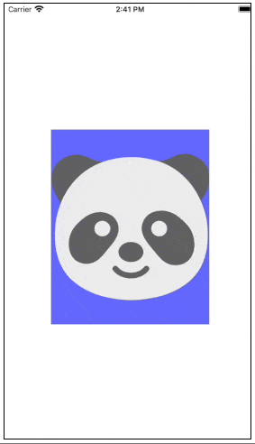

This application was developed as a skill accessment task for an iOS Developer position at an organization.

The following were the requirements
* Create an app with an UIImageView or just a UIView with a background color
* Add pan gesture to the smaller view/image view to allow the view to be dragged around
* Use UIKitDynamics to make the image return to the centre after the dragging is stopped (i.e) user lifts up their finger from the screen

The following GIF was provided as reference.

